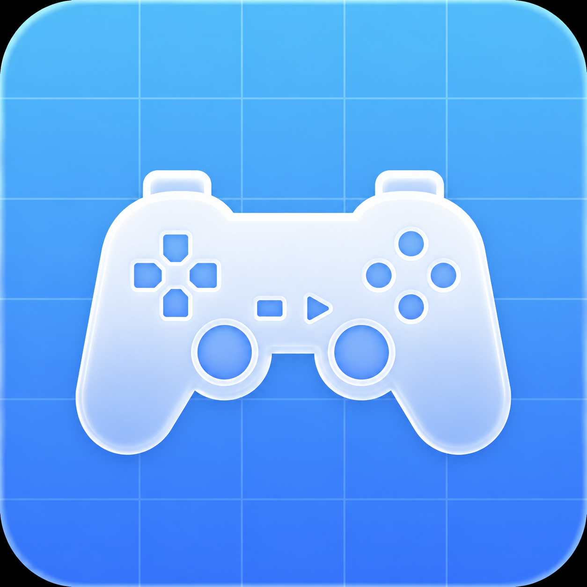

# Cascade

  

  <strong>A modern PS2 emulator for iPhone and iPad</strong> 
  Built with Swift · iOS 26 · Metal

  
  
  
  

---

## What is Cascade?

Cascade is a PlayStation 2 emulator for iOS devices. It runs PS2 game images (ISO/BIN) directly on your iPhone or iPad with a clean, native iOS 26 Liquid Glass UI. Cascade focuses on performance, accuracy, and a beautiful user experience.

---

## Getting Started

### Requirements

- iPhone or iPad running **iOS 26** or later
- A legally obtained PS2 BIOS file (`SCPH-70012.bin` recommended)
- PS2 game images in **ISO** or **BIN/CUE** format that you own

### Installing Cascade

Cascade is distributed as an unsigned IPA. You can install it using:

- **AltStore** — Connect your device, open AltStore, tap `+` and select the `Cascade.ipa`
- **Sideloadly** — Drag the IPA into Sideloadly and click Start
- **TrollStore** (A12+) — Tap the IPA and install directly for a permanent install

### First Launch

1. Open **Cascade** on your device
2. You'll be prompted to import your **PS2 BIOS** — tap the import button and select your BIOS file
3. Your BIOS is stored securely in the app's private container

### Adding Games

- Tap the **＋** button in the Library tab
- Select your ISO or BIN file from the Files app, AirDrop, or a connected server
- The game will appear in your library with cover art (fetched automatically when available)

### Playing a Game

- Tap any game in your library to launch it
- Use the on-screen controller or connect a **MFi / Bluetooth controller**
- Supported controllers: DualSense, DualShock 4, Xbox Series, Switch Pro

### In-Game Controls

| Action | On-Screen / Controller |
|---|---|
| Open Menu | Swipe down from top / Menu button |
| Save State | Menu → Save State → choose slot |
| Load State | Menu → Load State → choose slot |
| Screenshot | Menu → Screenshot |
| Settings | Menu → Settings |
| Exit Game | Menu → Exit to Library |

### Save States

Cascade supports **8 save state slots** per game. States are stored in the app and survive reinstalls (if you back up via iCloud or iTunes).

### Settings

| Setting | Description |
|---|---|
| Resolution Scale | 1× to 4× upscaling via Metal |
| Frame Limiter | Lock to 30/60 fps or uncapped |
| Widescreen Hack | Stretch to 16:9 (may cause glitches) |
| CPU Speed | Adjust EE clock for compatibility |
| Audio Backend | AVAudio or CoreAudio |
| Haptics | Haptic feedback on button press |
| Skin | Choose controller skin style |

---

## Compatibility

Cascade uses the PCSX2 core architecture adapted for iOS. Compatibility varies by game. Check the [compatibility list](docs/COMPATIBILITY.md) for known statuses.

| Status | Meaning |
|---|---|
| ✅ Playable | Runs well, minor issues at most |
| ⚠️ Ingame | Boots and runs but has issues |
| 🔶 Menus | Only menus work |
| ❌ Broken | Crashes or doesn't boot |

---

## Contributing

PRs and contributions are very welcome! Whether it's a bug fix, a new feature, a compatibility report, or improved documentation — all help is appreciated.

Please read [CONTRIBUTING.md](CONTRIBUTING.md) before opening a pull request.

---

## License

Cascade is open source under the **GPL-2.0** license. The PS2 BIOS is proprietary Sony software and is **not** included. You must supply your own legally obtained BIOS.
